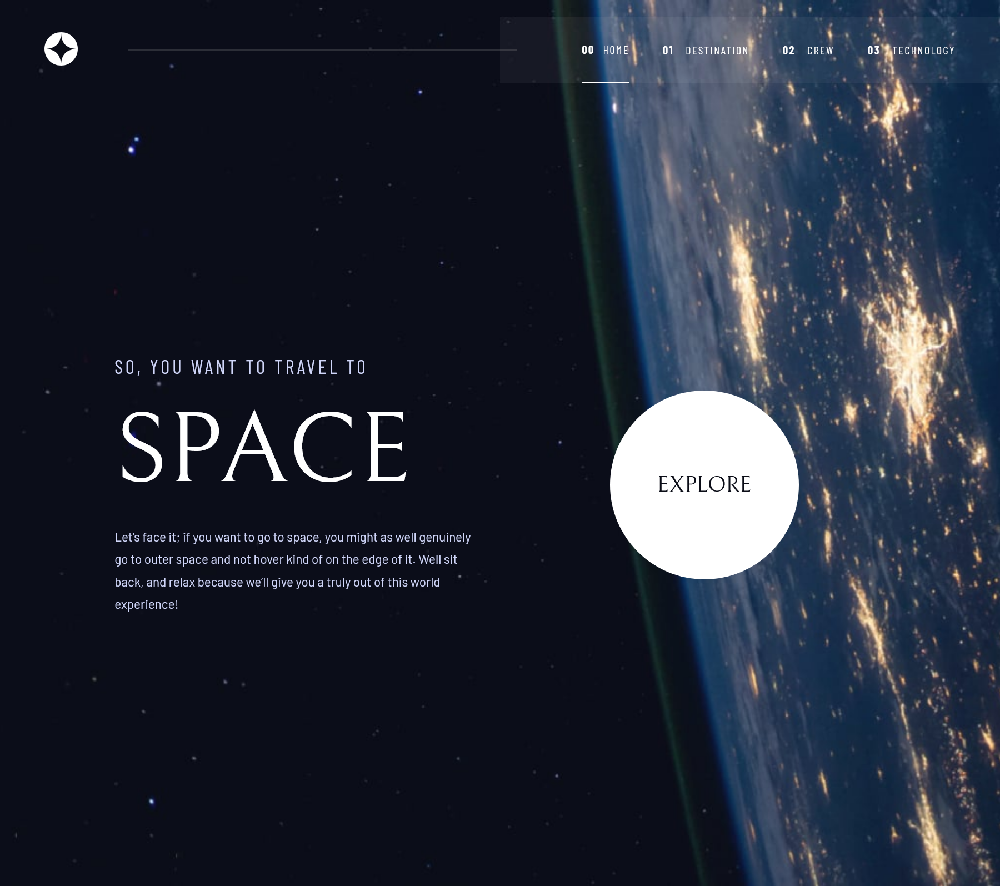
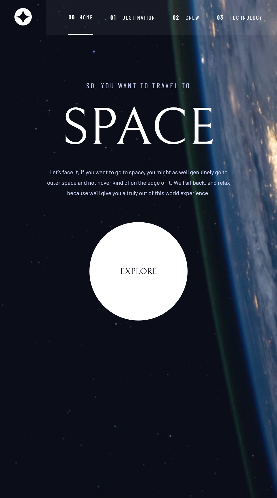
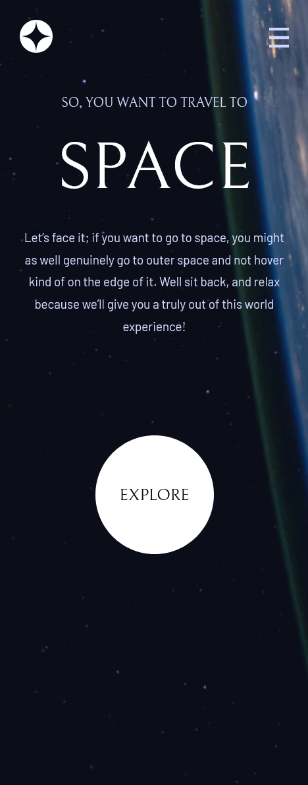

# Frontend Mentor - Space tourism website solution

This is a solution to the [Space tourism website challenge on Frontend Mentor](https://www.frontendmentor.io/challenges/space-tourism-multipage-website-gRWj1URZ3). Frontend Mentor challenges help you improve your coding skills by building realistic projects.

## Table of contents

- [Overview](#overview)
  - [The challenge](#the-challenge)
  - [Screenshot](#screenshot)
  - [Links](#links)
- [My process](#my-process)
  - [Built with](#built-with)
  - [Useful resources](#useful-resources)
- [Author](#author)
- [Acknowledgments](#acknowledgments)

**Note: Delete this note and update the table of contents based on what sections you keep.**

## Overview

### The challenge

Users should be able to:

- ✅ View the optimal layout for each of the website's pages depending on their device's screen size
- ✅ See hover states for all interactive elements on the page
- ✅ View each page and be able to toggle between the tabs to see new information

### Screenshot

🖼️ <b>Desktop</b>

🖼️ <b>Tablet Screenshot</b>

🖼️ <b>Mobile Screenshot</b>

🖼️ <b>Mobile Nav Active</b>

### Links

- Solution URL: [GitHub](https://github.com/marcfranciss/SpaceTourismWebsite.git)
- Live Site URL: [GitHub Pages](https://marcfranciss.github.io/SpaceTourismWebsite)

## My process

### Built with

- Semantic HTML5 markup
- Flexbox
- CSS Grid
- **[Sass](https://sass-lang.com/documentation/)**
- **[React](https://reactjs.org/)**
- **[Typescript](https://www.typescriptlang.org/docs/handbook/intro.html)**
- **[Vite](https://vitejs.dev/guide/)**

### Useful resources

- [Vite React App with Routes Deployed on Github | Reload error resolved!](https://github.com/ErickKS/vite-react-router?tab=readme-ov-file#05-specify-the-homepage-in-packagejson) - This helped me for to fix the 404 error when the other routes are refreshed.

## Author

- Website - [mackersdev.net](https://www.mackersdev.net)
- Frontend Mentor - [@marcfranciss](https://www.frontendmentor.io/profile/marcfranciss)

## Acknowledgments

Thank you for checking out this very simple project!

**Cheers!** 🍻
